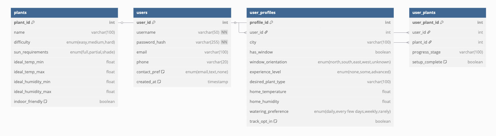

# wildhacks-2025

# Tracks: 
- Agriculture, productivity/wellness and Finance 
- Theme: Choose your own Adventure 

# Authors: 
- Vincent Yang 
- Lizbeth Yumbia
- Betty 
- Leo 

# Project Background # 
## Target audience: ## 
Target Audience: home growers in urban areas

## Problem Statement: ##
Problem: New home growers seeking to start indoor horticulture in small or limited spaces

# JTBD: #
When I’m starting to grow food at home for the first time, I want a simple way to learn which crops are right for my indoor space and how to care for them, so I can grow healthy plants successfully and feel confident in my gardening journey.

## Solution: ##
Our Solution: A user-friendly website that helps first-time growers learn the conditions needed to successfully grow their favorite crops indoors — and track their garden’s progress over time.

# User Journey: #

** User "set up" **  
1. Create Username/Password 
2. Users fills out questionare (make a codebook)
    - Which city do you live in 
    - Do you have access to window/ direct sunlight
        - What's the orientation of the windows 
        (find it with compass)
    - Have you grown plants before? 
    - What type of plant would you like to grow 
    - What temperature is your home right now? 
    - What is the humidity of your home?  
    - How much they want to water the plant 
3. Have a seperate page that shows we will help you track your progress
    - they can opt in or out
    - We will let you know if your plant needs "supplements" i.e. x hours of artificial sunlight, x more or less watering times, by sending it to your email or text
        - Ask for if they want to be emailed or texted 
4. User sees a dashboard with the reccomended plants for them (categorized), they will be shown plants that they want to grow be categorized into easy medium and hard. User clicks on cards, they will then exit set up 

5. Home page has the different cards that the user can check what progress they are on with different plants. They can click each one to expand and finish set up for the plant (if they have not)

6. User will be sent an email that tells them what to do that week. 

# Tech Stack # 

## Backend: ##
Part 1. Models 
    - Part A: Prediction of similar plants 

        what: Prediction of what plants would be good to plant, based on user preferences, and the conditions (temperature and humidity) of the user's home
        how: ML training on Jypter Notebook 
        Model input: Plant name, temperature, humidity 
        Model output: range of plants user can plant for different soil combinations 

        Possible datasets: 
            - https://www.kaggle.com/datasets/shankarpriya2913/crop-and-soil-dataset/data

      Part B: Forecasting future problems 
        what: Making predictions of plant health based on temeprature, humidity, amount of watering, amount of sunlight the plant is getting based on geographical location/ weather reports of geographical location. 

        Model inputs: weather conditions for the week, # of times watering, type of soil 
        Model outputs: Is the plant doing ok (yes or no)

        - Possible datasets: 
            - https://plantlightdb.com/
            - https://www.try-db.org/TryWeb/About.php
            - https://www.kaggle.com/datasets/ziya07/plant-health-data
            - https://www.kaggle.com/datasets/gorororororo23/plant-growth-data-classification

      Part C: Gemeni prompt generation (stretch goal (?)) 
        Input: Given the context of a plant (and image of plant), what tools the user has 
        Output: Generate reccomendations for the plant. 
        
        User can upload picture of plant to diagnose the problem. 

Part 2. Cloud Architecture 
- API gateway/ lambdas + RDS and S3 
    - We save user's email and pass and once verified we can pass token for each call (stretch goal)
    - User's questionare gets sent to S3 bucket 
    - User's opt in or out 
    - which plants the user selects 

Part 3. AWS SQS 
- User will be sent an email every week on instructions on how to take care of plants 
    - They will be notified on 
        - when they need to repot 
        - when they need to change the soil 
        - how often to irrigate it 
        - how much more artificial light in this upcoming week 
        - any changes to temperature? 

Part 4. AWS EC2 
    - Router/ web hosting where the server will return the website pages when called 
    - Pages we will have: 
        - username/pass
        - questionare page 
        - opt in/out 
        - recc plants 
        - home page  

Part 5. SQL/ RDS
- Connecting to the database using MySQLWorkbench

Part 6. API gateway 
Self explanatory 

# SPRINTS # 

## Sprint 1  1:00 PM - 6:00 PM ##

- Art and design wise: have all assets and designs ready by 6 PM Betty 
- by 6 PM finish parsing through the dataset, and setting up a basic model (does not need good prediction yet) - Leo 
- Set up AWS backend - Vi 
- Set up frontend with react - Liz

## Sprint 2 6:00PM - 11:00 PM ##

- Come up with ML model using the data from Kaggle to predict when your plant will die Leo (completed)
- Link up Leo's reccomendation model to populate the user's account, and forcasted model to SMS/SQS and look into how the automation will work. "Last potted" add to the API calls. - Vi 
- Integrate API calls in the front end, includes the get and post, onboarding dynamically changing the UI - Liz 
- Use Adobe AE to create a logo splash screen - Betty

## #Logistics and notes: ##
guide.wildhacks.net 
